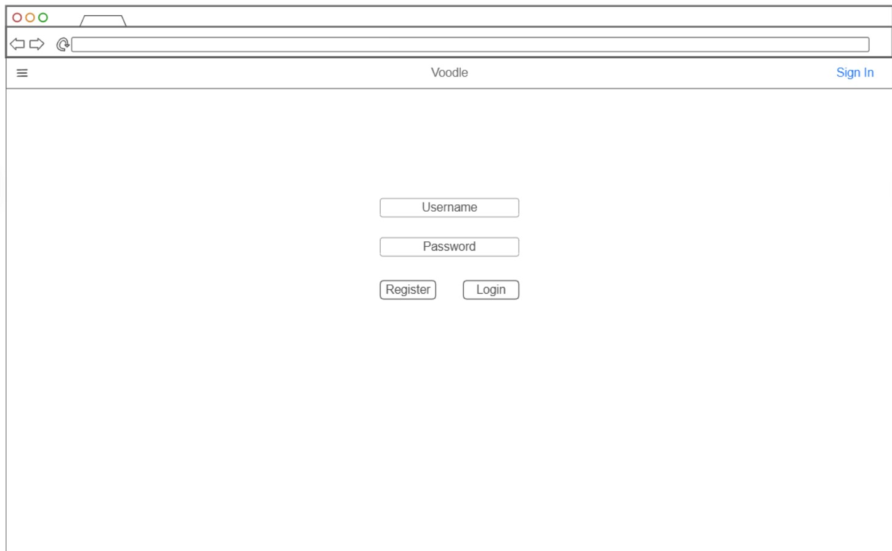
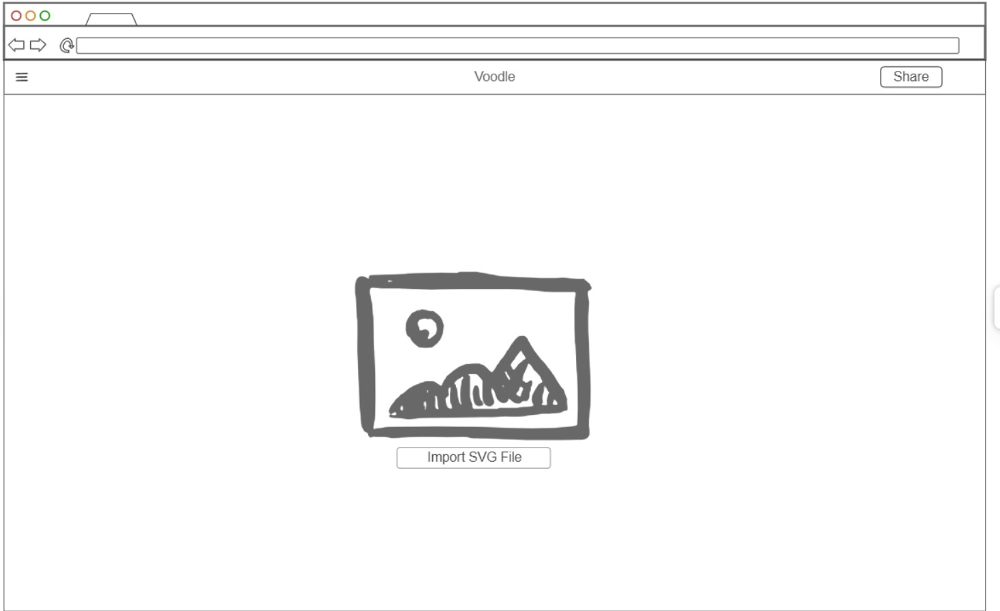

# Voodle

Voodle is a combination of vector and doodle and is a web application lets directly mark up SVG files, then securely share them with other users.

## Specification Deliverables

`Startup Specification`

### Elevator Pitch

For engineering design firms marking up Vector images can be difficult. Voodle lets you physically mark up the SVG file then securely share or transfer the newly modified SVG file to other users. Other applications require the SVG CAD file of the drawing to be converted into a pdf, then the markup notes remain in the PDF. Voodle will allow the markup notes to remain as elements of the SVG file itself. These elements will have all the advantages of being part of the SVG file itself and then securely shared to respective parties. With engineering firms keeping files secure is important to prevent theft of intellectual property.

### Design

_Login Page_

_Markup the Imported SVG_

_Secure Share_

### Key Features

- Secure login over HTTPS
- Secure sharing between users of markup vector drawings
- Preview of drawing
- Import of SVG for markup
- Export of SVG after markup
- Basic Markup Tools
    - Text
    - Lines
    - Arrows
    - Annotation Cloud

### Technologies

I will use the following technologies to implement my Voodle application.

- **HTML** - Correct HTML structure for application. Three HTML pages. One for login, one for importing and marking up SVG files, one for finding and securely sharing and receiving SVG files post markup.
- **CSS** - Consistent Application styling across the different pages. Styling that can take advantage of different screen sizes with full functionality on mobile.
- **React** - Provides login, file import, markup, file share and export
- **Service** - Backend service with endpoint for: 
    - Login
    - SVG import
    - User file share
    - SVG export
- **DB/Login** - Store users and user identification number, for secure sharing of drawings. Register login and assign user identification number. 
- **WebSocket** - Broadcast to other user when a file has been securely with them.
## HTML deliverable

➡️ The following is what I worked on for my `Startup HTML` deliverable

- [x] **HTML pages** - Create 5 HTML pages with similar features to modern website. The index.html has an about that explains what Voodle is, which will be added to as more features are added in subsequent assignments. The signin.html contains username and password input fields for and a sign in button as well as a button to the registration page. The register.html as text fields for username, email and password. The markup.html has a toolbar of useful markup commands on svg files. The share.html page contains text fields for recipient ID a button to choose a file to share and an optional description.  
- [x] **Links** - All pages currently have navigation links between each page, eventually to be put in a hamburger menu. Current website design has the home page with an about for the company with a sign in button in the header. Sign in button in the header that navigates to the sign in page it Sign in button links to the markup page. Within the header of the sign in page a button "create account" that links to the registration page. Markup page has a button with a share icon that links to the share page.  
- [x] **Text** - Home page contains a short snippet of text explaining Voodle. Text fields contain descriptions of what is entered or specifications for text entered 
- [x] **Images** - The home page has a marketing image that will eventually be replaced when final features are added. Markup has a place holder image for where the uploaded SVG's will be displayed. Unique icons for each head of the html pages to be displayed on the tabs depending which page you are in. Unique icons used for the share button, as well as the 6 placeholder toolbar buttons on the markup page. The larger images have a minimal amount of css to maintain reasonable size between screen sizes
- [x] **DB/Login** - Input boxes as well as sign in and registration buttons for the sign in page as well as the registration button. On successful registration a unique identification number is assigned with a place holder in the header of the share page. This identification number is used to obfuscate the identifying information of users to more securely share modified svg's.
- [x] **WebSocket** - On the share page the the user id number is a place holder to be associated with a login account and is retrieved from the database for the purpose of secure share between users. Notification to receiving user when modified svg is delivered. on the markup page place holder for where notification of file shared.
## CSS deliverable

➡️ The following is what I worked on for my `Startup CSS` deliverable

- [x] **CSS pages** - A main styles.css that has consistent colors across all pages, then there is a form.css page which has styling for the form used on by the sign in register and share. 
- [x] **Navigation** - Hamburger menu button with navigation links to all the HTML pages
- [x] **Header Styling** - Style across all the headers with a hamburger menu button on the left for navigation to other pages.
- [x] **Main Styling** - Colors and fitting pictures, with styling on the forum across the share.html, signin.html and register.html.
- [x] **Footer Styling** - Colors with author and Github link distributed.
- [x] **Navigation Menu** - Hamburger menu button with navigation to all pages
- [x] **Window Resizing** - Works and looks good across all Screen sizes including smartphone.
- [x] **Images** - Images sized to the width of the webpages.
- [x] **Text** - Formatted text and location.